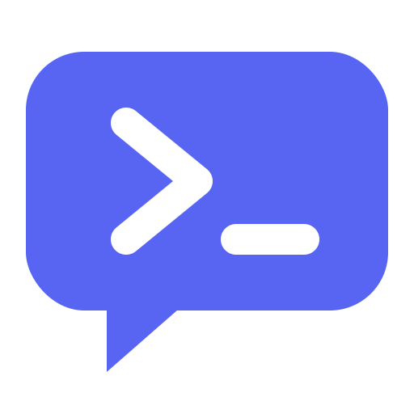
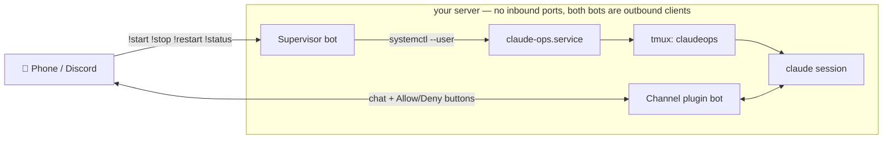

<div align="center">



# disclaude-sesh

**Drive Claude Code on your home server from Discord on your phone.**

[](https://github.com/aerwk/disclaude-sesh/stargazers)
[](https://github.com/aerwk/disclaude-sesh/releases/latest)
[](https://discord.gg/R9nVksxWvm)

[**Installation 💻**](docs/installation.md) • [**Security 🔐**](docs/security.md) • [**Troubleshooting 🛠️**](docs/troubleshooting.md) • [**License 📄**](LICENSE)

</div>

Claude Code's remote surfaces — Remote Control, the mobile app, channel plugins — all share one rule: they can only attach to a session that's **already running**. That's fine on a laptop. But if the CLI lives on an always-on server, with your workspace there and every other machine just a window into it, that rule becomes the lockout: forget to start a session before you leave, let one crash or hit the ~10-minute network timeout, or reboot the box — and Claude Code is unreachable until you can SSH back in. There is no native way to *start* a session remotely on a headless server.

**disclaude-sesh is the missing start button.** A deliberately-dumb supervisor bot turns sessions on and off through systemd (`!start` `!stop` `!restart` `!status`), the official Discord channel plugin carries the conversation and the Allow/Deny permission buttons, and systemd + tmux keep it all alive across reboots, crashes, and dropped connections — with **zero inbound ports**, since both bots are outbound clients.



## Features

- **Chat from anywhere** — message a live Claude Code session on your server from Discord, DM or channel, via the official `discord@claude-plugins-official` channel plugin.
- **Session control** — `!start` `!stop` `!restart` `!status` through a deliberately-dumb supervisor bot: four fixed verbs mapped to systemd, no shell passthrough by design.
- **Approvals on your phone** — tool permission prompts arrive as Allow/Deny buttons in Discord.
- **Channel buttons (optional)** — a small patch moves approval buttons from DMs into your ops channel, and an auto-repatcher re-applies it after every plugin update — or alerts you in Discord when upstream changed too much to patch safely.
- **Unattended resilience** — systemd user units + linger survive reboots, tmux survives disconnects, a restart loop survives crashes.
- **Locked down** — single-user allowlist on both bots; strangers are silently dropped.
- **Zero inbound ports** — both bots connect outbound to Discord; nothing to forward, nothing to expose.
- **One config file** — everything lives in `~/.config/claude-ops.env`.
- **Autonomous mode (opt-in)** — `CLAUDE_OPS_SKIP_PERMISSIONS=1` runs the session without approval prompts for fully hands-off ops; risks documented under [Permission modes](docs/security.md#permission-modes).

## Prerequisites

Have these ready **before** starting the [installation](docs/installation.md):

- **A Linux server** you can leave running, with systemd **user sessions** (any mainstream distro; check with `systemctl --user status`)
- **[Claude Code](https://code.claude.com/docs/en/quickstart) v2.1.81+**, installed on that server and authenticated with a **claude.ai account or Claude Console API key** — channels are not available on Bedrock, Vertex, or Foundry; on Team/Enterprise plans an admin must [enable channels](https://code.claude.com/docs/en/channels#enterprise-controls) first (Pro/Max personal accounts need no extra step)
- **A Discord account** and a **server (guild) you control** — you'll create two bot applications in the [Developer Portal](https://discord.com/developers/applications) and a private ops channel during installation
- **Discord on your phone**, signed into that account — the whole point
- **Discord Developer Mode** enabled (User Settings → Advanced → Developer Mode) so you can right-click → *Copy User ID* / *Copy Channel ID*
- **CLI tools:** `git`, `tmux`, [Bun](https://bun.sh), `curl`, `python3` (the last two are used by the optional repatcher)

> Channels are a research preview feature; command syntax may change. The guides match the docs as of mid-2026.

## Repository layout

```text
bin/claude-ops.sh              launcher: tmux-wrapped restart loop around claude
bin/claude-ops-repatch.sh      optional: keeps the channel-buttons patch applied
supervisor/supervisor.ts       the !start/!stop/!restart/!status bot (Bun + discord.js)
systemd/*.service              the two user units
workspace/CLAUDE.md            the ops session's standing instructions — edit for your server
examples/claude-ops.env.example  config template for ~/.config/claude-ops.env
examples/access.json.example   what the plugin's access file looks like when set up
docs/installation.md           both install paths + usage, commands, uninstall
docs/security.md               permission modes + security notes
docs/troubleshooting.md        symptoms and fixes
docs/channel-buttons-patch.md  the optional patch, its safety model, and the repatcher
```

## Contributing

Issues and PRs welcome — for problems, include the relevant `journalctl` lines (mind your tokens).

## License

[MIT](LICENSE). This project wires together [Claude Code](https://code.claude.com/docs/en/overview)
and its official [Discord channel plugin](https://github.com/anthropics/claude-plugins-official) —
it is not affiliated with or endorsed by Anthropic or Discord. The optional
channel-buttons patch modifies the plugin's locally cached files on your
machine only.
