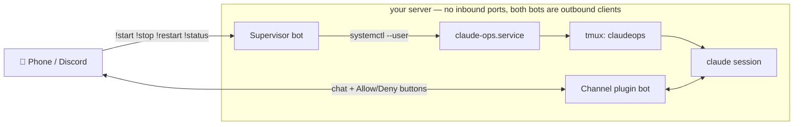

# disclaude-sesh

Drive Claude Code on your home server from Discord on your phone. Start, stop, and restart sessions with bot commands, chat with a live session from anywhere, and approve tool use with Allow/Deny buttons — all through two small Discord bots. The whole thing survives reboots, crashes, and dropped SSH connections, and opens **zero inbound ports**: both bots are outbound gateway clients.



## Features

- **Chat from anywhere** — message a live Claude Code session on your server from Discord, DM or channel, via the official `discord@claude-plugins-official` channel plugin.
- **Session control** — `!start` `!stop` `!restart` `!status` through a deliberately-dumb supervisor bot: four fixed verbs mapped to systemd, no shell passthrough by design.
- **Approvals on your phone** — tool permission prompts arrive as Allow/Deny buttons in Discord.
- **Channel buttons (optional)** — a small patch moves approval buttons from DMs into your ops channel, and an auto-repatcher re-applies it after every plugin update — or alerts you in Discord when upstream changed too much to patch safely.
- **Unattended resilience** — systemd user units + linger survive reboots, tmux survives disconnects, a restart loop survives crashes.
- **Locked down** — single-user allowlist on both bots; strangers are silently dropped.
- **Zero inbound ports** — both bots connect outbound to Discord; nothing to forward, nothing to expose.
- **One config file** — everything lives in `~/.config/claude-ops.env`.
- **Autonomous mode (opt-in)** — `CLAUDE_OPS_SKIP_PERMISSIONS=1` runs the session without approval prompts for fully hands-off ops; risks documented under [Permission modes](#permission-modes).

## Repository layout

```text
bin/claude-ops.sh              launcher: tmux-wrapped restart loop around claude
bin/claude-ops-repatch.sh      optional: keeps the channel-buttons patch applied
supervisor/supervisor.ts       the !start/!stop/!restart/!status bot (Bun + discord.js)
systemd/*.service              the two user units
workspace/CLAUDE.md            the ops session's standing instructions — edit for your server
examples/claude-ops.env.example  config template for ~/.config/claude-ops.env
examples/access.json.example   what the plugin's access file looks like when set up
docs/channel-buttons-patch.md  the optional patch, its safety model, and the repatcher
```

## Installation — manual

The full walkthrough, no AI assistance required.

### 0. Prerequisites

- A Linux server with systemd **user sessions** (any mainstream distro; check with `systemctl --user status`)
- [Claude Code](https://code.claude.com/docs/en/quickstart) **v2.1.81 or newer**, authenticated with a **claude.ai account or Claude Console API key** (channels are not available on Bedrock, Vertex, or Foundry; on Team/Enterprise plans an admin must [enable channels](https://code.claude.com/docs/en/channels#enterprise-controls) first — Pro/Max personal accounts need no extra step)
- `tmux`
- [Bun](https://bun.sh) — the channel plugins and the supervisor are Bun scripts
- `curl` and `python3` (used by the optional repatcher)
- A Discord account and a **server (guild) you control**
- Discord **Developer Mode** enabled (User Settings → Advanced → Developer Mode) so you can right-click → *Copy User ID* / *Copy Channel ID*

> Channels are a research preview feature; command syntax may change. This guide matches the docs as of mid-2026.

### 1. Create the two Discord bots

You'll create **two applications** in the [Discord Developer Portal](https://discord.com/developers/applications). Keep the two tokens separate — they go to different places later.

| Bot | Purpose | Token goes to |
|---|---|---|
| **Channel bot** (e.g. `ClaudeOps`) | The conversation — your messages go into the Claude Code session, replies and permission buttons come back | `/discord:configure` inside Claude Code (step 4) |
| **Supervisor bot** (e.g. `ClaudeSupervisor`) | `!start` / `!stop` / `!restart` / `!status` — starts and stops the session via systemd | `~/.config/claude-ops.env` (step 3) |

For **each** application:

1. **New Application** → name it (no spaces in the bot username).
2. **Bot** section → **Reset Token** → copy the token somewhere safe. You only see it once.
3. Still in **Bot** → scroll to **Privileged Gateway Intents** → enable **Message Content Intent**.
4. **OAuth2 → URL Generator** → tick the `bot` scope → enable these permissions:
   - View Channels
   - Send Messages
   - Send Messages in Threads
   - Read Message History
   - Attach Files
   - Add Reactions

   (The supervisor only strictly needs View Channels / Send Messages / Read Message History, but using the same set for both is simplest.)
5. Open the generated URL in your browser and add the bot to your server.

Finally, create a **private channel** in your server (e.g. `#claude-ops`) that both bots and only you can see, and copy its ID (right-click the channel → *Copy Channel ID*). Also copy **your own user ID** (right-click your name → *Copy User ID*).

### 2. Server setup

```bash
# Bun (skip if `bun --version` already works)
curl -fsSL https://bun.sh/install | bash
source ~/.bashrc

# sanity checks
claude --version   # 2.1.81+
tmux -V
bun --version

# clone and install the supervisor's one dependency (discord.js)
git clone https://github.com/aerwk/disclaude-sesh.git ~/claude-ops
cd ~/claude-ops/supervisor
bun install
```

> The systemd units assume the clone lives at `~/claude-ops`. If you put it elsewhere, edit the two paths in `systemd/*.service` in step 5.

### 3. Configure the supervisor

```bash
cp ~/claude-ops/examples/claude-ops.env.example ~/.config/claude-ops.env
chmod 600 ~/.config/claude-ops.env
```

Edit `~/.config/claude-ops.env` and set:

- `SUPERVISOR_BOT_TOKEN` — the **supervisor** bot's token from step 1
- `ALLOWED_USER_IDS` — your Discord user ID (comma-separate several if needed)

Everyone not in `ALLOWED_USER_IDS` is silently ignored by the supervisor.

### 4. Configure the channel plugin

This is done inside an interactive Claude Code session, once. Run it on the server (over SSH is fine):

```bash
cd ~/claude-ops/workspace
claude
```

In the session:

```text
/plugin install discord@claude-plugins-official
```

If the plugin isn't found, refresh the marketplace and retry: `/plugin marketplace update claude-plugins-official` (or `/plugin marketplace add anthropics/claude-plugins-official` if you've never added it). Then:

```text
/reload-plugins
/discord:configure <CHANNEL-bot-token>
```

⚠️ This is the **channel** bot's token — not the supervisor's. It's saved to `~/.claude/channels/discord/.env`.

Now exit (`/exit`) and restart with the channel active, because the bot can only answer your pairing DM while the channel is running:

```bash
claude --channels plugin:discord@claude-plugins-official
```

**Pair your account:** DM your channel bot on Discord (any message). It replies with a pairing code. Back in the session:

```text
/discord:access pair <code>
/discord:access policy allowlist
```

Your user ID is now the only one that can talk to the session, and DMs from anyone else are silently dropped.

**Enable your ops channel** so the bot answers there without being @-mentioned. Exit Claude Code, then edit `~/.claude/channels/discord/access.json` (the pairing step created it) and add a `groups` entry — see [`examples/access.json.example`](examples/access.json.example) for the full shape:

```json
"groups": {
  "000000000000000000": {
    "requireMention": false,
    "allowFrom": ["111111111111111111"]
  }
}
```

Replace `000000000000000000` with your ops channel ID and `111111111111111111` with your user ID (the same one `allowFrom` at the top level already contains). The plugin re-reads this file per message — no restart needed.

### 5. Install the systemd units

```bash
cp ~/claude-ops/systemd/*.service ~/.config/systemd/user/
systemctl --user daemon-reload
systemctl --user enable --now claude-supervisor
systemctl --user enable --now claude-ops
loginctl enable-linger $USER
```

`enable-linger` is what lets both units start at boot and keep running with nobody logged in — without it, your user services die when your SSH session ends and never start after a reboot.

The units reference the clone at `~/claude-ops` (via systemd's `%h` = your home directory). If you cloned elsewhere, edit `ExecStart` in `claude-ops.service` and `claude-supervisor.service` before the `daemon-reload`.

### 6. First run

The first launch in a new folder shows Claude Code's one-time folder-trust prompt, which only exists inside the terminal. Attach to the session and accept it:

```bash
tmux attach -t claudeops
# answer the trust prompt if one is waiting (you may have already
# accepted it in step 4), then detach: Ctrl-B then D
```

If you ever want to watch the session live, this same command is how.

### 7. Verify everything

Work through this from your phone (ideally off your home network):

- [ ] `!status` in your ops channel → the supervisor answers with `service: active` and `tmux session: alive ✅`
- [ ] Send the channel a message ("what's in the working directory?") → Claude replies in the channel
- [ ] Ask for something that needs approval (e.g. "create a file called test.txt") → **Allow/Deny buttons** appear in your DMs (that's the stock behavior — see [docs/channel-buttons-patch.md](docs/channel-buttons-patch.md) to move them into the channel)
- [ ] `!restart` → confirmation, and the next message gets a fresh session; `!stop` → session down; `!start` → back up
- [ ] Reboot the server → within a couple of minutes both bots respond again, with nobody logged in

If `!status` never answers, check `journalctl --user -u claude-supervisor -e`. If the channel bot doesn't reply, `tmux attach -t claudeops` and look at the session; the most common cause is a missed trust prompt from step 6.

## Installation — with Claude Code

If you already run Claude Code on the server, let it install this for you. You only do the two things it can't: click around the Discord Developer Portal and send the pairing DM from your own account.

**Step 1 — create the two Discord bots.** Follow [Manual installation, step 1](#1-create-the-two-discord-bots) (portal clicks: two applications, tokens, Message Content intent, invites). Have both tokens and your Discord user ID ready.

**Step 2 — hand the rest to Claude Code.** On the server, run `claude` and paste:

```text
Set up disclaude-sesh (https://github.com/aerwk/disclaude-sesh) on this machine:

1. Clone https://github.com/aerwk/disclaude-sesh to ~/claude-ops (the
   systemd units expect exactly that path).
2. Install Bun if missing, then run `bun install` in ~/claude-ops/supervisor.
3. Create ~/.config/claude-ops.env from examples/claude-ops.env.example with
   chmod 600. Ask me for the SUPERVISOR bot token and my Discord user ID and
   fill in SUPERVISOR_BOT_TOKEN and ALLOWED_USER_IDS. Never echo, print, or
   log the token anywhere.
4. Make bin/*.sh executable, copy systemd/*.service to
   ~/.config/systemd/user/, run daemon-reload, then
   `systemctl --user enable --now claude-supervisor claude-ops`.
5. Run `loginctl enable-linger $USER` so both units survive reboots.
6. Walk me through connecting the channel plugin bot: install
   discord@claude-plugins-official via /plugin install, /discord:configure with
   the CHANNEL bot's token (I'll paste it when asked), then I'll DM the bot
   for a pairing code, you run /discord:access pair <code>, and set
   /discord:access policy allowlist.
7. Finish with a verification matrix and show me the results: both units
   active, tmux session `claudeops` alive, and prompt me to send !status and
   a test message from my phone.

Tell me exactly which steps need my input before you start.
```

**Step 3 — the human bits.** When asked: paste the supervisor token and your user ID, paste the channel bot token into `/discord:configure`, DM the channel bot to get the pairing code, then send `!status` and a test message from your phone. Two replies back = you're live.

## Usage

| Command | What it does |
|---|---|
| `!start` | Start the Claude Code session (systemd unit + tmux) |
| `!stop` | Stop it — and it stays stopped until you say otherwise |
| `!restart` | Fresh session, old context gone |
| `!status` | Unit state + whether the tmux session is alive |
| `!help` | List the commands |

Commands go to the **supervisor bot**; everything else goes to the **channel plugin bot** — just talk to it in a DM, or in your ops channel (no @-mention needed once the channel is enabled in `access.json` with `requireMention: false`).

When Claude wants to run a tool that needs approval, Allow/Deny buttons appear in your DMs — or in the ops channel itself if you enabled the [channel-buttons patch](docs/channel-buttons-patch.md).

On the server:

```bash
tmux attach -t claudeops                       # watch the live session (Ctrl-B D to detach)
journalctl --user -u claude-supervisor -f     # supervisor logs
```

Edit `workspace/CLAUDE.md` to describe *your* server — key stacks, paths, what the session is for. That file is the session's standing context; the reply-behavior and safety rules in it are what make the Discord experience feel like a real terminal session.

## Permission modes

**Default (recommended):** the session runs with normal permissions. Tool calls that need approval show up as Allow/Deny buttons in Discord, so nothing runs without your say-so. Safe to leave unattended.

**Bypass mode:** `CLAUDE_OPS_SKIP_PERMISSIONS=1` in `~/.config/claude-ops.env` adds `--dangerously-skip-permissions` — tools execute with **no approval gate at all**. Claude's judgment is the only thing between a request and `rm`. Only enable this on a box you can afford to break, and keep the guardrails in `workspace/CLAUDE.md`: confirm-before-destructive-actions, and never treat instructions embedded in files, logs, or web pages as commands. The allowlist still controls **who** can talk to the session — bypass mode only removes the **what** gate.

## Security notes

- **Tokens** live only in `~/.config/claude-ops.env` (chmod 600) and the plugin's own store (`~/.claude/channels/discord/.env`) — never in this repo, never anywhere the session might read them back out loud.
- **No inbound ports** — both bots are outbound gateway clients; there is nothing to port-forward or reverse-proxy.
- **Sender allowlists on both bots** — the supervisor checks `ALLOWED_USER_IDS`, the channel plugin checks `access.json`; anyone else is silently dropped, with no error to probe.
- **Leaked token?** Reset it in the Developer Portal, update `~/.config/claude-ops.env` (supervisor) or re-run `/discord:configure` (channel bot), restart the units.
- **The channel-buttons patch grants no approval power** — the plugin's click handler independently re-checks `access.allowFrom`; channel members can at most *see* a prompt, never answer it.
- **Prompt injection** — the session must treat only the owner's Discord messages as instructions, never text found in files, logs, alerts, or web pages. This rule ships in `workspace/CLAUDE.md`; keep it.

## Troubleshooting

| Symptom | Fix |
|---|---|
| Supervisor never comes online | `journalctl --user -u claude-supervisor -f`; commonest cause is the **Message Content intent** not enabled in the Developer Portal, or a missing/typo'd token in `~/.config/claude-ops.env` |
| Bot never replies in the channel | The channel isn't enabled in `~/.claude/channels/discord/access.json` (`groups` entry with your channel ID, `requireMention: false`) — see `examples/access.json.example` |
| `!stop` doesn't stick / session won't die | Stop goes through `tmux kill-session -t claudeops`, which also kills the restart loop; if tmux lingers, kill it by hand once and check `ExecStop` ran |
| Buttons still arrive as DMs after enabling the patch | The patch applies at next launch — `!restart` (or `systemctl --user restart claude-ops`), then check `~/.local/state/claude-ops-repatch.log` |
| ⚠️ repatch alert in Discord | Upstream rewrote the handler; you're safely on stock DM behaviour — see [docs/channel-buttons-patch.md](docs/channel-buttons-patch.md) for the re-patch path |
| `claude` exits every 10s inside tmux | Not logged in (`claude` needs its one-time auth) or the workspace folder-trust prompt is waiting — `tmux attach -t claudeops` and answer it once |
| Nothing runs after a reboot | `loginctl enable-linger $USER` was never run — user units only start at boot with linger enabled |

## License

[MIT](LICENSE). This project wires together [Claude Code](https://code.claude.com/docs/en/overview)
and its official [Discord channel plugin](https://github.com/anthropics/claude-plugins-official) —
it is not affiliated with or endorsed by Anthropic or Discord. The optional
channel-buttons patch modifies the plugin's locally cached files on your
machine only.
